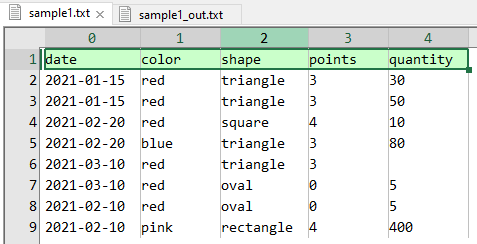
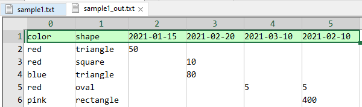

# Pivotdude

Pivotdude is a utility to pivot data from an input file in a user-desired way.

Pivotdude can be ran manually, or integrated into an automated-process/work-flow.  In general it follows the [UNIX philosophy](https://en.wikipedia.org/wiki/Unix_philosophy) much as possible.

# Project Motivation

Pivotting data can be accomplished in numerous ways; however for everyday users it is typically done in Excel.  The problem with Excel is that to pivot against a combination of columns, things become janky fast; values are appended together, pivot tables become nested and need reformatting, processing hangs on vast data, and so forth.  Of course, it also goes without saying this process is not easy to automate.

Pivotdude is a command line approach to easily take tab-separated values from a file and output to stdout the pivot-table.

# Pre-Compiled Binaries

Binaries (.exe) for Windows OS have been pre-compiled and can be found in the 'bin' folder.

With git, you can download all the latest source and binaries with `git clone https://github.com/chipnetics/pivotdude`

Alternatively, if you don't have git installed:

1. Download the latest release [here](https://github.com/chipnetics/xertools/archive/refs/heads/master.zip)
2. Unzip to a local directory.
3. Navigate to 'bin' directory for executables.

# Compiling from Source

Utilities are written in the V programming language and will compile under Windows, Linux, and MacOS.

V is syntactically similar to Go, while equally fast as C.  You can read about V [here](https://vlang.io/).

Each utility is its own .v file, so after installing the [latest V compiler](https://github.com/vlang/v/releases/), it's as easy as executing the below.  _Be sure that the V compiler root directory is part of your PATH environment._

```
git clone https://github.com/chipnetics/pivotdude
cd src
v build pivotdude.v
```
Alternatively, if you don't have git installed:

1. Download the bundled source [here](https://github.com/chipnetics/pivotdude/archive/refs/heads/main.zip)
2. Unzip to a local directory
3. Navigate to src directory and run `v build pivotdude.v`

Please see the [V language documentation](https://github.com/vlang/v/blob/master/doc/docs.md) for further help if required.

# Viewing Large Files

As an aside, the author recommends the excellent tool _EmEditor_ by Emurasoft for manually editing or viewing large text-based files for data science & analytics. Check out the tool [here](https://www.emeditor.com/).  _EmEditor_ is paid software but well worth the investment to increase effeciency.

# Running Command Line Arguments

For Windows users, if you want to pass optional command line arguments to an executable:

1. Navigate to the directory of the utility.
2. Hold Shift + Right Mouse Click.
3. Select "Open PowerShell Window Here".
4. Type the name of the exe along with the optional argument (i.e. `./pivotdude.exe [OPTIONS]` ).

# Command Line Options

```
Usage: pivotdude [SHORT-OPTION]... [STRING]...
or: pivotdude LONG-OPTION

Pivot input data on specific column combination.
Note that columns are 0-index based.

  -p (required)         comma-separated list of pivot indexes
  -h (required)         column to generate header from
  -v (required)         column of values to extract
  -f (required)         the input file to pivot
  -nh                   indicate input file has no header
     --help             display this help and exit
     --about            author and licence information
     --version          output version information and exit'
```

***

# Examples

----

`./pivotdude.exe -f ..\examples\sample1.txt -p 1,2 -v 4 -h 0 > ..\examples\sample1_out.txt`

**sample1.txt :::**



**sample1_out.txt :::**

